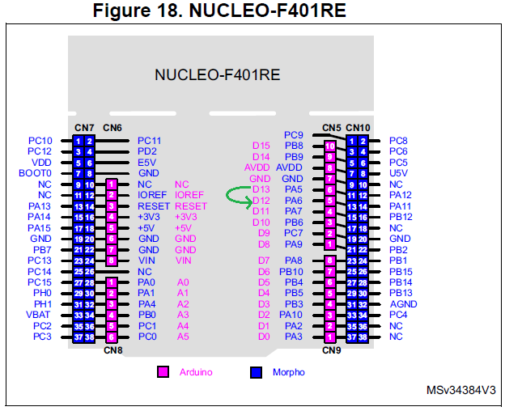
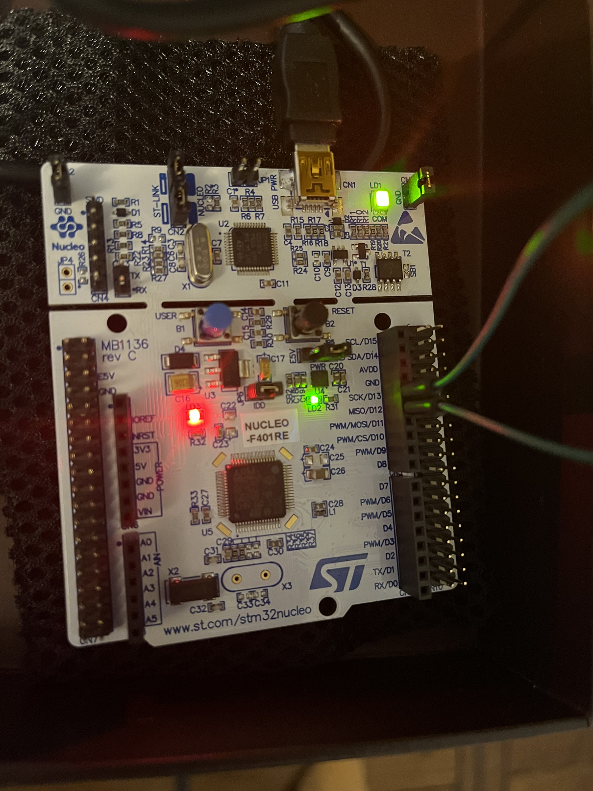

# Embedded Systems Bare-Metal Programming Ground Up™ (STM32): Program 14

[Code Development follows this Udemy Course](https://www.udemy.com/course/embedded-systems-bare-metal-programming/)

## Specs

Host

* MS Windows 10.0.19042
* STM32CubeIDE 1.8.0

Device

* STM32F401RE chip
* STM32 Nucleo-64 development board

## Description

This program demonstrates how one pin on the nucleo board can capture the output of another pin.

In this case, PA6 (D12) is capturing the output of PA5 (D13).

## Design

Nucleo-64 Board Layout Guide

Nucleo-64 Board Layout 

## Output

### Video of Debugger

### Video of Board

